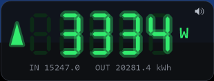
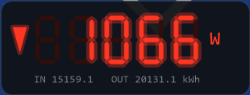

# powerchk


A small always-on-top Windows widget that shows live grid power from an
**everHome EcoTracker** as glowing seven-segment LED digits.

- **Consumption / import** → red
- **Feed-in / export** → green
- Tiny in/out kWh counters along the bottom (toggle with `SHOW_COUNTERS`)
- A small **cyan dot** (top-right) means the reading is coming from the cloud
  fallback rather than the local device.
- **Sound alert** on a green→red edge (export→import). Right-click to toggle;
  the setting is remembered. Off with `sound_alert=0`; custom WAV via `alert_sound`.

Single self-contained translation unit. No third-party libraries: WinHTTP for
the meter/cloud requests, Winsock for the one-time OAuth2 login redirect, GDI+
for the per-pixel-alpha layered window. Static CRT (`/MT`), so the built EXE
depends only on system DLLs — no redistributable.

## Screenshots

| Feeding in (export) | Consuming (import) |
|:---:|:---:|
|  |  |
| Green digits + ▲ = exporting to the grid | Red digits + ▼ = drawing from the grid |

## Data sources

powerchk polls the EcoTracker's **local REST API** (`http://<ip>/v1/json`) once
a second. If the local address is unreachable, it falls back to the everHome
**cloud API** (OAuth2), polling more slowly. The cloud path is only used while
the local device is down, and only if credentials are configured.

### Enabling the EcoTracker local API

The local JSON endpoint (`http://<ip>/v1/json`) is served only when the
device's **Local HTTP server** is switched on. It is **off by default**, so a
fresh EcoTracker will not answer until you enable it.

1. Open the **everHome app** and select your **EcoTracker** device.
2. Open its settings and turn on **Local HTTP server**
   (German UI: *Lokaler HTTP-Server*).
3. From the PC that will run powerchk, open `http://<ecotracker-ip>/v1/json`
   in a browser. You should get a small JSON object containing `power`,
   `energyCounterIn`, and `energyCounterOut`.

Once enabled the endpoint responds on port 80 with **no authentication** and is
readable by anything on the same LAN. `power` is negative when feeding in and
positive when consuming — which is why powerchk ships with
`NEGATIVE_IS_FEEDIN = true`. (You can confirm the current state on the device
object in `everhome_devices.json`: `"jsonHttpServer": true`.)

If the browser check fails: verify the PC and the meter are on the same
network/VLAN and that the IP is right. Until the local endpoint responds,
powerchk shows dashes unless the cloud fallback is configured.

## Build in Visual Studio 2022

1. Open `powerchk.sln`.
2. Pick **Release / x64** (or Debug).
3. Build (Ctrl+Shift+B). Output: `x64\Release\powerchk.exe`.

Requires the **Desktop development with C++** workload (toolset v143, Windows
10/11 SDK).

## Build from the command line

From an *x64 Native Tools Command Prompt for VS 2022*:

```
rc /nologo /fo powerchk\powerchk.res powerchk\powerchk.rc
cl /nologo /std:c++17 /O2 /MT /EHsc /DUNICODE /D_UNICODE powerchk\powerchk.cpp powerchk\powerchk.res ^
   /link /SUBSYSTEM:WINDOWS user32.lib gdi32.lib gdiplus.lib winhttp.lib ^
   shell32.lib ws2_32.lib winmm.lib
```

## Run

```
powerchk.exe                          rem local: http://192.168.1.111/v1/json, 1 s
powerchk.exe 192.168.1.111            rem local host or IP
powerchk.exe http://host/v1/json 2000 rem full local URL + poll interval (ms)
powerchk.exe --login [port]           rem one-time cloud enrollment
```

Drag the window from anywhere with the left mouse button. **Resize** by dragging
any edge or corner — the LED aspect ratio is preserved and the digits scale as
crisp vector shapes (no bitmap blur). The zoom is remembered across restarts
(`scale=` in the credential file). Right-click for a menu: toggle the sound
alert, **Reset size**, or **Exit**.

## Cloud fallback setup (optional)

The cloud is only needed when the local API is unreachable. everHome uses the
OAuth2 **authorization-code** grant, so a refresh token has to be minted once
through a browser login — after that, powerchk runs headless from the file.

1. Copy `powerchk.credentials.example` → `powerchk.credentials` (next to the EXE).
2. Create an OAuth2 app at
   <https://everhome.cloud/en/developer/applications> and set its **redirect URL**
   to `http://localhost:53127/callback`. Paste the Client ID / Secret into the file.
3. Run `powerchk.exe --login`. Approve access in the browser. powerchk stores
   the `refresh_token` and writes `everhome_devices.json` next to the EXE.
4. Find your EcoTracker in `everhome_devices.json` and put its id in `device_id`.

From then on, `powerchk.exe` (no args) uses local first and cloud as a fallback.

### Notes & caveats

- **Rate limit:** everHome does not publish a cloud rate limit, so the fallback
  polls conservatively — default `cloud_interval_ms=60000` (60 s), configurable
  in the credential file (minimum 5 s). Local polling is unaffected.
- **Cloud response shape:** the cloud reader pulls the meter's live `power` /
  `energyCounterIn` / `energyCounterOut` from the device's `states` (it skips
  the `statedefinitions` metadata that reuses the same names). `device_id` is
  the numeric `id` of your EcoTracker in `everhome_devices.json`. If a
  single-device GET isn't served, powerchk automatically falls back to
  `GET /device`; you can also set `cloud_device_path` explicitly.
- **Secrets:** `powerchk.credentials` holds long-lived secrets in plaintext.
  Restrict its ACL (see the comment in the file). For stronger protection,
  wrapping the secret/refresh values with DPAPI (`CryptProtectData`) is the
  natural next step.
- **Token rotation:** if everHome rotates the refresh token on refresh,
  powerchk writes the new one back into `powerchk.credentials` automatically.

## Configuration (compile-time)

Constants near the top of `powerchk.cpp`:

- `NEGATIVE_IS_FEEDIN` — sign convention of the meter's `power` field.
- `SHOW_COUNTERS` — show/hide the bottom kWh line.
- `DIGIT_COUNT` — number of seven-segment cells (default 5 → up to 99999 W).

## Roadmap

- Second pane for SMA inverter production (the layout in `MakeLayout` and the
  `Reading` struct extend to more than one source).
